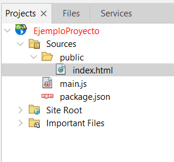
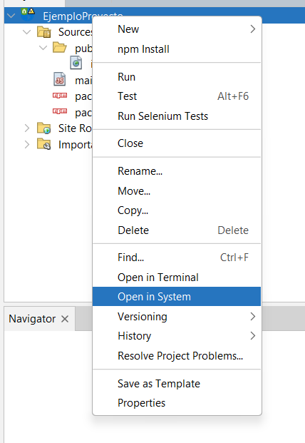
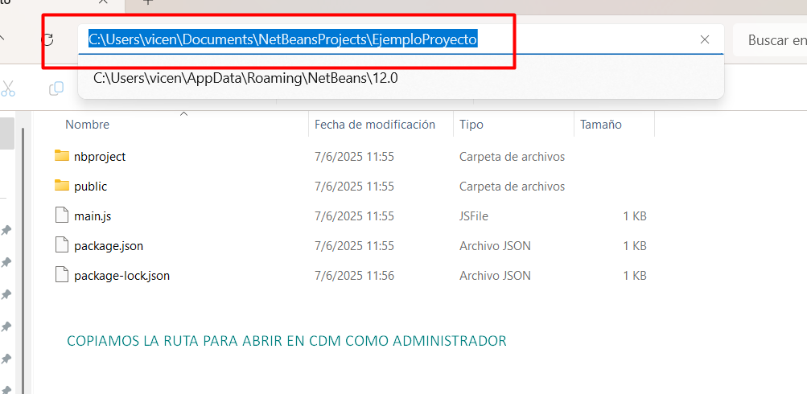
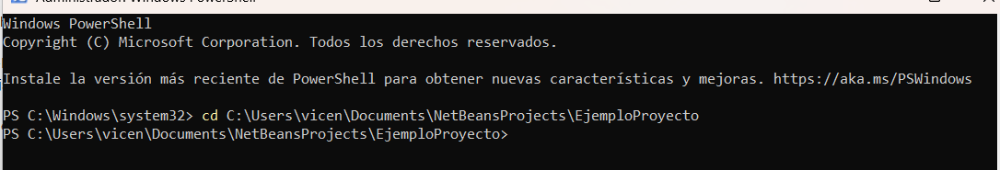
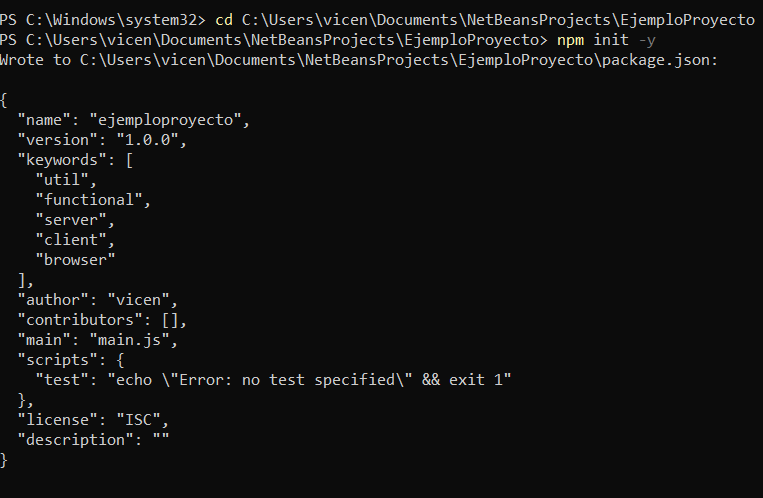
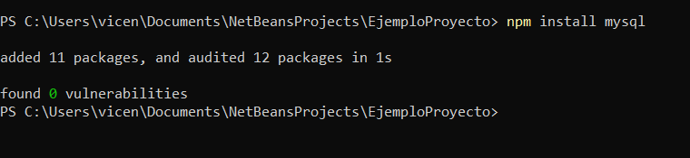
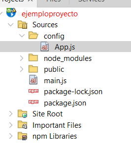
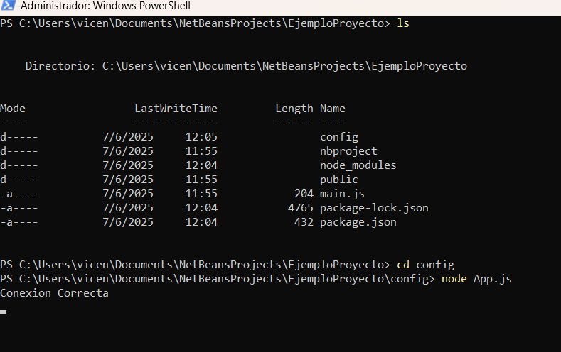
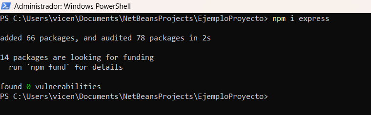

## Apuntes para Web

1. Primero debemos levantar Node 

> Iras a netbeans 
, Nuevo proyecto , ´HTML5/JavaScript´ > ´HTML5/JS Aplication With Node.js´

<br>

Proyect Name: EjemploProyecto
Dejamos que cree el packjson










## npm init -y 


> El comando npm init -y se utiliza en proyectos de Node.js para crear rápidamente un archivo package.json con valores predeterminados.

<br>

## Instalacion mysql 



<br>

## Creamos el directorio y App.js



Adentro de esta carpeta mysql y express


<br>

Aca el codigo 

```Javascript

/* 
 * Click nbfs://nbhost/SystemFileSystem/Templates/Licenses/license-default.txt to change this license
 * Click nbfs://nbhost/SystemFileSystem/Templates/ClientSide/javascript.js to edit this template
 */

//Variable mysql al cual llama a la libreria
const mysql = require('mysql');


// Datos de configuracion de conexion a mysql
const oConexion =  mysql.createConnection({
    host:'localhost',
    database: 'ejemplo7625',
    user: 'root',
    password : ''
});

//Realizamos Conexion si existe un posible error dara un error en caso de lo 
//contrario  dara una conexion correcta
oConexion.connect(function (posibleError){
   if(posibleError){
       console.log('Error al conectar', posibleError.message);
   }else{
       console.log('Conexion Correcta');
   } 
    
});


```

```Bash

cd config 
# Aca iniciaremos la app con node 
node App.js

```
<br>




<br>

instalamos express <br>

https://www.npmjs.com/package/express

```bash

npm i express 

```




```Javascript
//Añades esta linea arriba del archivo App.js
const express = require('express');
const app = express();

//Variable mysql al cual llama a la libreria
const mysql = require('mysql');


// Datos de configuracion de conexion a mysql
const oConexion =  mysql.createConnection({
    host:'localhost',
    database: 'ejemplo7625',
    user: 'root',
    password : ''
});

//Realizamos Conexion si existe un posible error dara un error en caso de lo 
//contrario  dara una conexion correcta
oConexion.connect(function (posibleError){
   if(posibleError){
       console.log('Error al conectar', posibleError.message);
   }else{
       console.log('Conexion Correcta');
   } 
    
});


// Motor de vista ejs
app.set('view engine','ejs');
// Le indicamos la carpeta donde se encontran los archivos ejs que sera views
app.set('views',path.join(__dirname,'views'));


// Selecciona todos los productos y lanza un error si no renderiza como respuesta a la pagina index con los productos
app.get('/',(req, res) => {
    const sql = "SELECT * FROM productos";
    oConexion.query(sql,(error,results) =>{
        if (error){
            throw error;
        }else{
            res.render('index',{productos:results});
        }
    });
});    


// Cuando entremos a la ruta editarProductos/1 por ejemplo va a seleccionar el producto  y recibe el id por get 
// seleccciona el producto desde la base de datos con su id "No actualiza solo devuelve el producto"
app.get('/editarProductos/:id',(req, res) =>{
    const id = req.params.id;
    const sql = "SELECT * FROM productos WHERE id = " + id;
    oConexion.query(sql, (error, results) =>{
        if (error) throw error;
        res.render('editarProductos',{producto:results[0]});
    });
    
}); 

/**
 * Aca vamos a la ruta /actualiza/1 por ejemplo recibimos el codigo 
 * id atrave url  y hacemos una actualizacion dandole un nuevo nombre , descripcion , precio donde el id es el que corresponde 
 * 
 * llamamos a oConexion.query  y le consultamos si existe un error que lanze un error 
 * y si no en nuestra consola dira Registro actualizado correctamente 
 * 
 * y nos redirije a la pagina principal
*/

app.post('/actualizar/:id',(req, res) =>{
    const id = req.params.id;
    const result = req.body;
    const sql = "UPDATE productos SET nombre='"+ result.nombre+"',descripcion = '"+result.descripcion+"',precio = '"+result.precio+"' WHERE id = "+ id +" ";

        oConexion.query(sql, (error) => {
            if (error) throw error;
            console.log("Registro realizado correctamente");
            res.redirect("/");
        });
       });


/**
 * Vamos a la pagina /insertar  resivimos los datos en la variable result atraves del body del req  insertamos el datos
 * con la consulta sql 
 * si existe un error nos lanza un error 
 * si no en la consola nos dira registro exitoso 
 * y nos redirije a pagina principal
*/
 
app.post('/insertar',(req, res) =>{
    const result = req.body;
    const sql = "INSERT INTO productos VALUES(NULL, '"+result.nombre+"','"+result.descripcion+"','"+result.precio+"' )";
 
    oConexion.query(sql,(error) =>{
        if (error){
            throw error;
        }else{
            console.log("Registro exitoso");
            res.redirect('/')
        }
    });
});    


/**
 * Aca estamos en la ruta /borrar 
 * recibimos el del producto  y realizamos la consulta sql concatenda con su id 
 * si existe un error nos lanza un error  si no en consola nos dira  Registro eliminado correctamente
 * y nos llevara a la pagina principañ
 * 
*/
app.post('/borrar',(req,res) =>{
    const id = req.body.idProducto;
    const sql = "DELETE FROM productos WHERE id = " + id;
    oConexion.query(sql,(error) =>{
        if (error)throw error;
        console.log("Registro eliminado correctamente");
        res.redirect('/');
    });
});
    
/**
 * Habilitamos puerto 3000 
 * 
 * para que escuche la app que es express 
*/
const PORT = 3000;
app.listen(PORT,() =>{
      console.log('Servidor corriendo en htpp://localhost:' + PORT);
  } );


```
