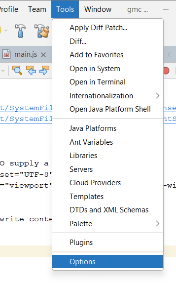

## Orden de carpetas 

config --> Aca va la bd y App.js
public --> va sources (Imagenes videos etc) y aca va la carpete de styles css
node_modules (Esta es automatica)
views -> Esta es muy importante aca se alojan los .ejs



---

```Javascript

/* 
 * Click nbfs://nbhost/SystemFileSystem/Templates/Licenses/license-default.txt to change this license
 * Click nbfs://nbhost/SystemFileSystem/Templates/ClientSide/javascript.js to edit this template
 */


const express = require('express');
const app = express();

const mysql = require('mysql');

//Es importante por la rutas para el ejs
const path = require('path');

const oConexion =  mysql.createConnection({
    host:'localhost',
    database: 'productos_db',
    user: 'root',
    password : ''
});

oConexion.connect(function (posibleError){
   if(posibleError){
       console.log('Error al conectar', posibleError.message);
   }else{
       console.log('Conexion Correcta');
   } 
    
});


//Motor 
app.set('view engine','ejs');
//Indicamos donde buscara en carpeta buscara el ejs
app.set('views', path.join(__dirname,'../views'));
//se utiliza en aplicaciones Node.js con Express para poder leer datos enviados 
//desde formularios HTML a través de solicitudes POST.
app.use(express.urlencoded({ extended: false }));


// READ
app.get('/',(req, res) => {
    const sql = "SELECT * FROM productos";
    oConexion.query(sql,(error,results) =>{
        if (error){
            throw error;
        }else{
            res.render('index',{productos:results});
        }
    });
});    


// INSERT
app.post('/insertar', (req,res) =>{
    
    const nombre = req.body.nombre;
    const precio = req.body.precio;

    //INSERT INTO productos (nombre, precio) VALUES ('Lápiz', 500),

    const sql = "INSERT INTO productos (nombre , precio) VALUES ('"+nombre+"','"+precio+"') ";
    
    oConexion.query(sql, (error , results)=>{
       
        if(error){
            throw error;
        }else{
           
        res.redirect('/');

        }
    });
});

/**
 * 
 * DELETE
 * Cuando viene por get :id debe ser con rq¿eq.params.varibles*/
app.get('/eliminar/:id' , (req , res)=>{
    const id = req.params.id;

    
    const eliminar = "DELETE FROM productos WHERE id="+id+" ";
    
    oConexion.query(eliminar, (error , results)=>{
       if(error){
           throw error;
           
       } else{
           res.redirect('/');
       }
    });
    
});


/*
 * Renderizamos la pagina de actualizacion con el producto en si
 */
app.get('/actualizar/:id', (req , res)=> {
    
    const id = req.params.id;
    const seleccionar = "SELECT * FROM productos WHERE id="+id+"";
    
    oConexion.query(seleccionar, (error , results) => {
       if(error){
           throw error;
       }else{
           
           res.render('editar', {producto:results[0]});
       } 
    });
    
});


app.post('/actualizar' , (req , res)=>{
   const nombre = req.body.nombre;
   const precio = req.body.precio;
   const id = req.body.id;
   
   //UPDATE `productos` SET `nombre` = 'EJEMPLO 22' WHERE `productos`.`id` = 10;
   const actualizar = "UPDATE productos SET nombre='"+nombre+"' , precio="+precio+" WHERE id="+id+"    ";
   
   oConexion.query(actualizar , (error) => {
       if(error){
           throw error;
       }else{
           
           res.redirect("/");
       }
   } );
    
});


const PORT = 3000;
app.listen(PORT,() =>{
      console.log('Servidor corriendo en http://localhost:' + PORT);
  } );


```

